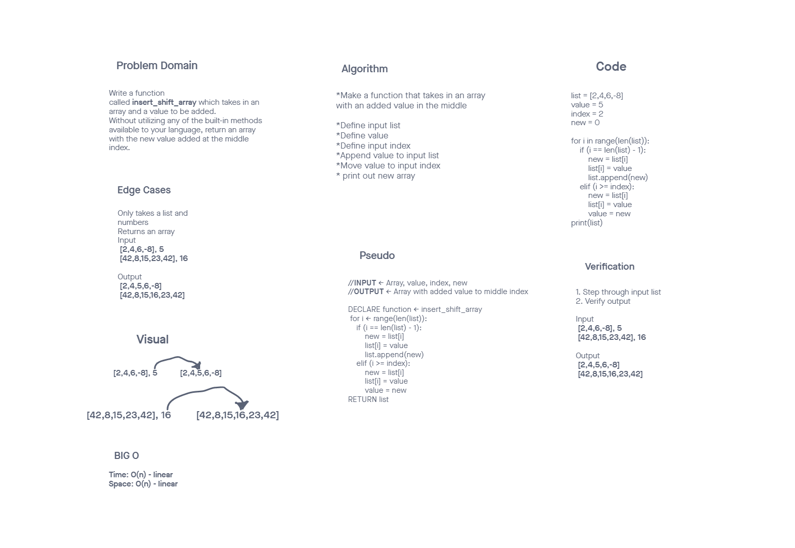

# Insert to Middle of an Array
<!-- Description of the challenge -->
Code challange 02: Given a list and a number as input aphend the number into the middle of the list.

## Whiteboard Process
<!-- Embedded whiteboard image -->

## Approach & Efficiency
<!-- What approach did you take? Discuss Why. What is the Big O space/time for this approach? -->
Used a for loop to go through the list and append the input number according to a given index.
Space and time were linear for this code challange. Bigger list will take slightly more time.

[Code challange Readme]{<https://canvas.instructure.com/courses/3826570/assignments/26339184>}

Credits:
Clarisa
