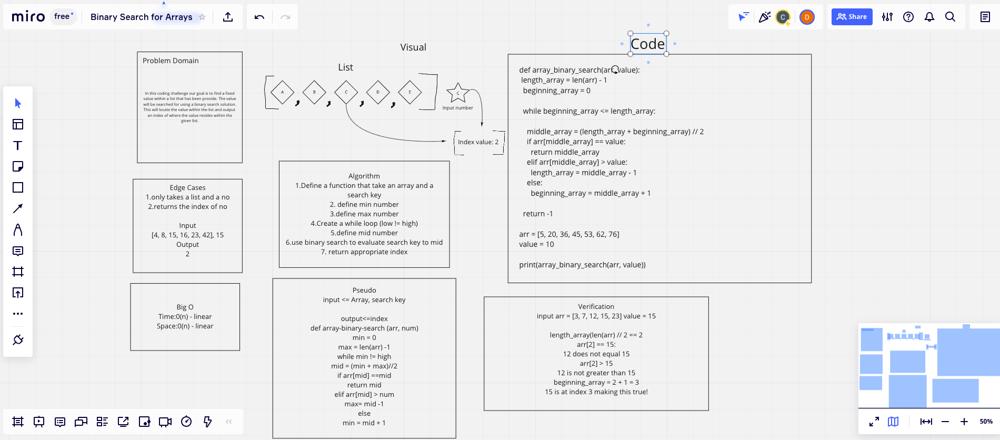

# Binary Search of Sorted Array
<!-- Description of the challenge -->
Write a function called BinarySearch which takes in 2 parameters: a sorted array and the search key. Without utilizing any of the built-in methods available to your language, return the index of the array’s element that is equal to the value of the search key, or -1 if the element is not in the array.

## Whiteboard Process
<!-- Embedded whiteboard image -->

## Approach & Efficiency
<!-- What approach did you take? Discuss Why. What is the Big O space/time for this approach? -->

We used binary to search the middle number and if it equal to value, return value, else if it is greater than middle number change the high to equal middle -1 else low equal middle +1.

Time is linear in this case and space might be slighly linear as the only new thing being save/created is the index.
