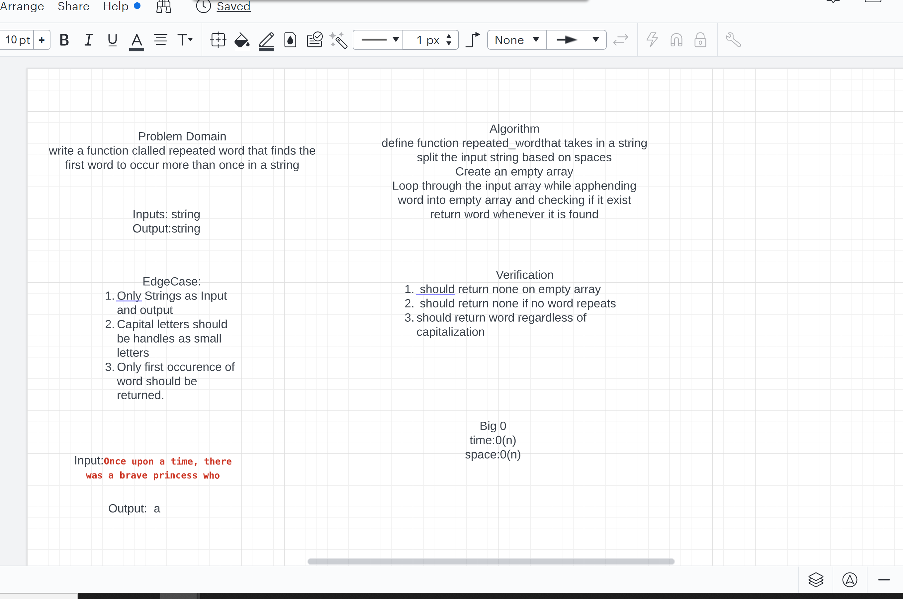

# Hashtable

## Implementation: Hash Tables

### Specifications

Read all of these instructions carefully.
Name things exactly as described.
Do all your work in a your data-structures-and-algorithms public repository.
Create a new branch in your repo named as noted below.
Follow the language-specific instructions for the challenge type listed below.
Update the “Table of Contents” - in the README at the root of the repository - with a link to this challenge’s README file.
Challenge Setup & Execution
Branch Name: hashtable

Challenge Type: New Implementation

### Features

Implement a Hashtable Class with the following methods:

set
Arguments: key, value
Returns: nothing
This method should hash the key, and set the key and value pair in the table, handling collisions as needed.
Should a given key already exist, replace its value from the value argument given to this method.
get
Arguments: key
Returns: Value associated with that key in the table
contains
Arguments: key
Returns: Boolean, indicating if the key exists in the table already.
keys
Returns: Collection of keys
hash
Arguments: key
Returns: Index in the collection for that key
Structure and Testing
Utilize the Single-responsibility principle: any methods you write should be clean, reusable, abstract component parts to the whole challenge. You will be given feedback and marked down if you attempt to define a large, complex algorithm in one function definition.

## Write tests to prove the following functionality

Setting a key/value to your hashtable results in the value being in the data structure
Retrieving based on a key returns the value stored
Successfully returns null for a key that does not exist in the hashtable
Successfully returns a list of all unique keys that exist in the hashtable
Successfully handle a collision within the hashtable
Successfully retrieve a value from a bucket within the hashtable that has a collision
Successfully hash a key to an in-range value
Ensure your tests are passing before you submit your solution.

Documentation: Your README.md

<!-- Short summary or background information -->

## Challenge
<!-- Description of the challenge -->

## Approach & Efficiency
<!-- What approach did you take? Why? What is the Big O space/time for this approach? -->

## API
<!-- Description of each method publicly available in each of your hashtable -->
Submission Instructions
Create a pull request from your branch to your main branch
In your open pull request, leave as a comment a checklist of the specifications and tasks above, with the actual steps that you completed checked off
Submitting your completed work to Canvas:
Copy the link to your open pull request and paste it into the corresponding Canvas assignment
Leave a description of how long this assignment took you in the comments box
Add any additional comments you like about your process or any difficulties you may have had with the assignment
Merge your branch into main, and delete your branch (don’t worry, the PR link will still work)

