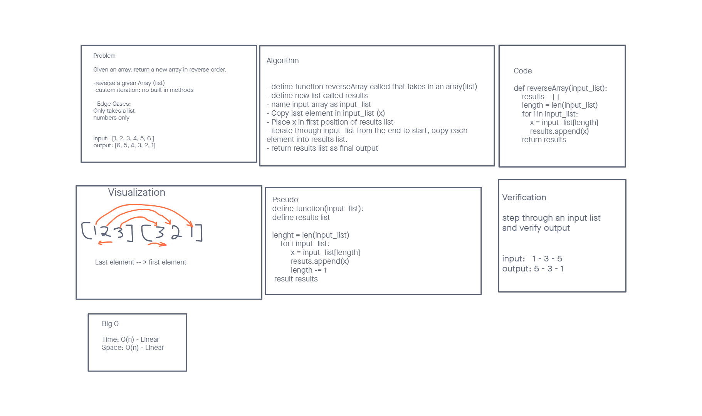

# Reverse an Array
<!-- Description of the challenge -->
code challange 01 : Given a list return a list with itemss in a reverse order

## Whiteboard Process
<!-- Embedded whiteboard image -->

## Approach & Efficiency
<!-- What approach did you take? Discuss Why. What is the Big O space/time for this approach? -->
We used a for loop to go through the list and aphend each item to the end of a new array. It seemed more efficient espcially since we could not use any python methods to reverse the list. Time was linear and space was also linear

[Code challange Readme]{<https://canvas.instructure.com/courses/3826570/assignments/26339183>}

Credits
Ian Cargill
