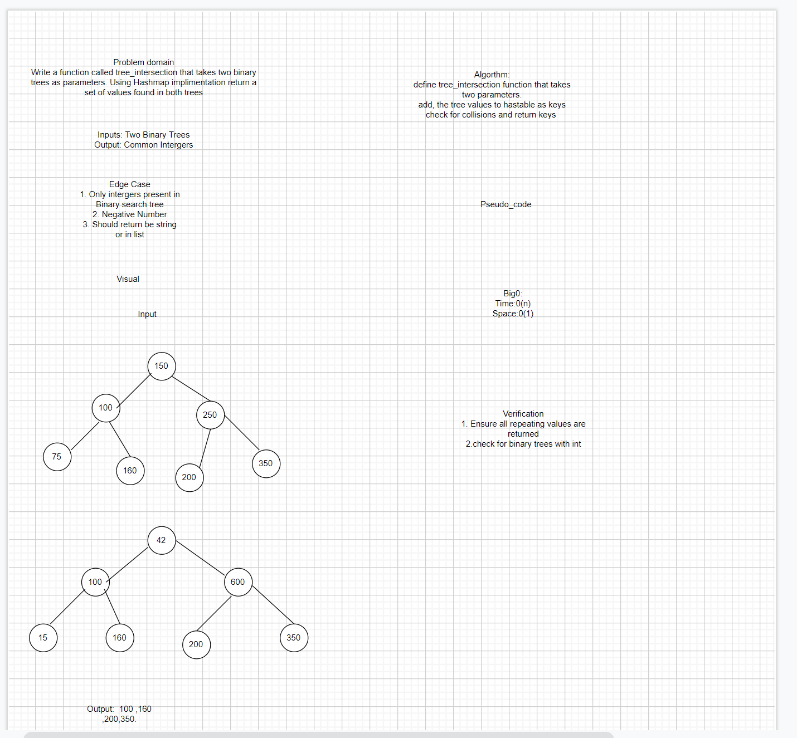

# Find common values in 2 binary trees

## Specifications

1. Read all of the following instructions carefully. Name things exactly as described.
2. Do all your work in a public repository (matching the example provided by your instructor) called    data-structures-and-algorithms, with a well-formatted, detailed top-level README.md
3. Create a branch in your repository called tree-intersection
4. On your branch, create…

C#: Create a new class library with a class file named TreeIntersection.cs
JavaScript: a folder named treeIntersection which contains a file called tree-intersection.js
Python: a folder named tree_intersection which contains a file called tree_intersection.py
Java: a folder named TreeIntersection which contains a file called TreeIntersection.java

Include any language-specific configuration files required for this challenge to become an individual component, module, library, etc.

NOTE: You can find an example of this configuration for your course in your class lecture repository.

## Feature Tasks

1. Write a function called tree_intersection that takes two binary trees as parameters.
2. Using your Hashmap implementation as a part of your algorithm, return a set of values found in both trees.

## Structure and Testing

Utilize the Single-responsibility principle: any methods you write should be clean, reusable, abstract component parts to the whole challenge. You will be given feedback and marked down if you attempt to define a large, complex algorithm in one function definition.

Write at least three test assertions for each method that you define.

Ensure your tests are passing before you submit your solution.

Example
Input:

BinaryTree1

BinaryTree2

Output:

100,160,125,175,200,350,500

## Stretch Goal

Describe how you might solve this differently if the parameters were Binary Search Trees.
What are the potential efficiency differences?

## Requirements

Ensure your complete solution follows the standard requirements.

Write unit tests
Follow the template for a well-formatted README
Submit the assignment following these instructions

