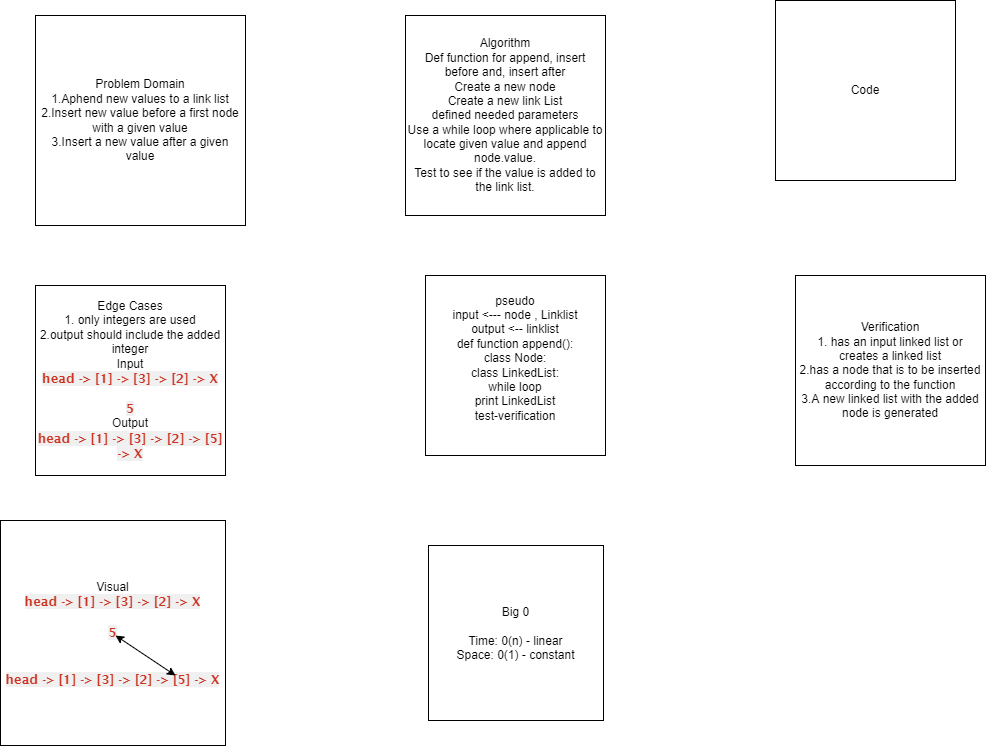

# Challenge Summary
<!-- Description of the challenge -->
1. adds a new node with the given value to the end of the list

2. adds a new node with the given new value immediately before the first node that has the value specified

3. adds a new node with the given new value immediately after the first node that has the value specified

## Whiteboard Process
<!-- Embedded whiteboard image -->

## Approach & Efficiency
<!-- What approach did you take? Why? What is the Big O space/time for this approach? -->

## Solution
<!-- Show how to run your code, and examples of it in action -->

[Code challange Readme]{<https://canvas.instructure.com/courses/3826570/assignments/26339188>}
